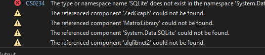

# circuit-calculator

A project of wireless power designed to help organize the mathematical story viz equations and experimental data for generating proofs

## Needing attention

Address the missing external libraries that are not being packaged:

